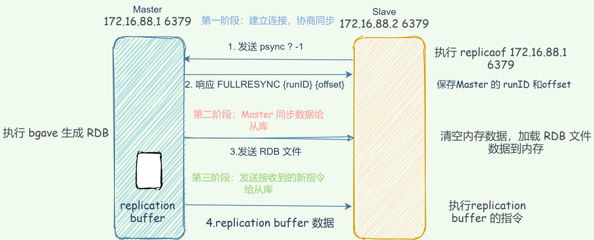
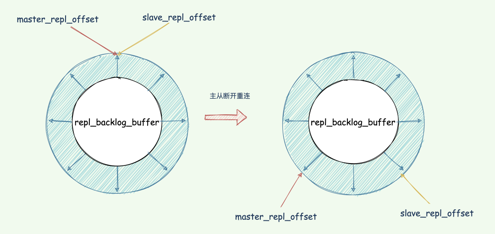
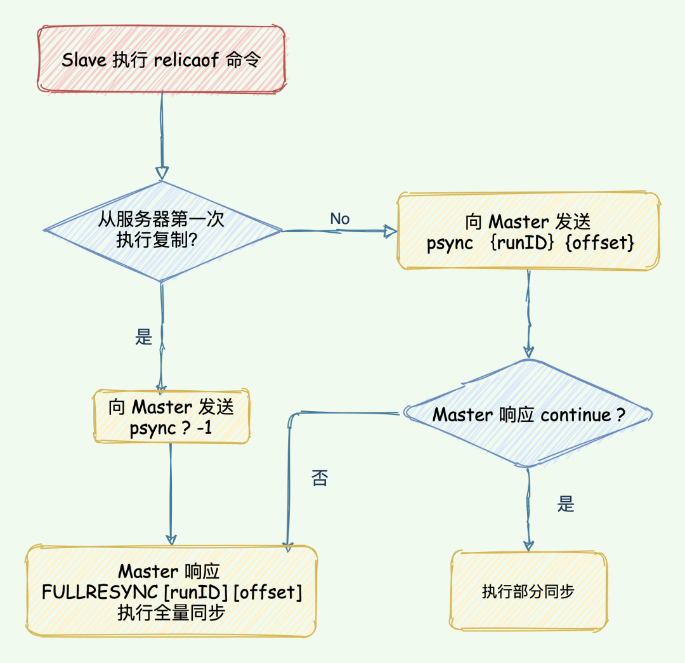
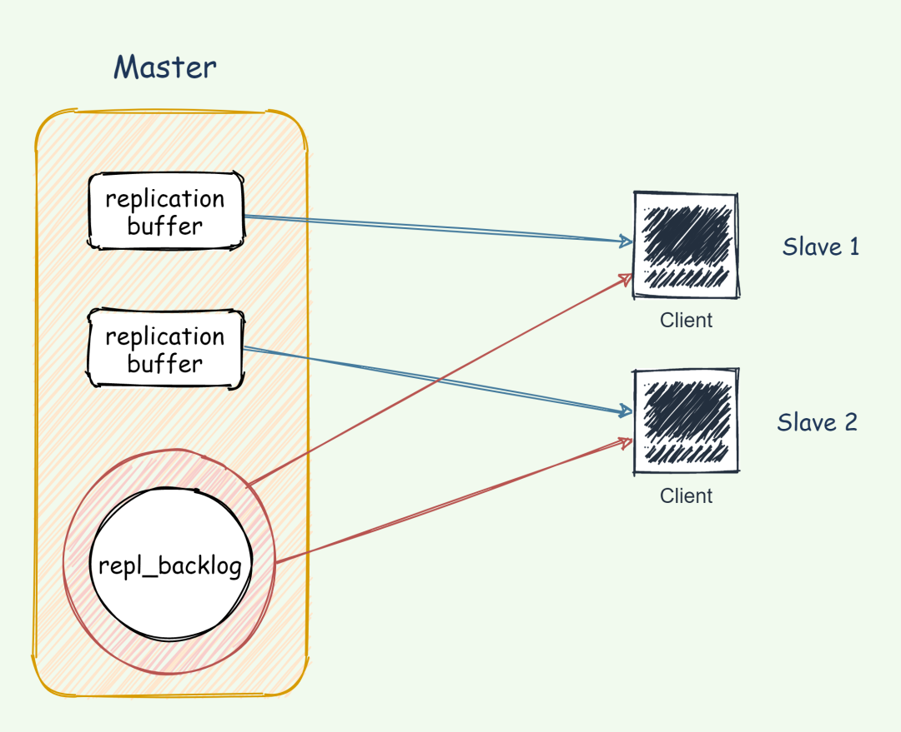

# `Redis`主从架构数据同步原理

## 主从架构如何保证数据一致性？

读写分离。写操作只在主库，读执行操作主库和从库都可以执行。如果写操作可以在主库和从库进行，为了保持数据一致性就需要在`Redis`进行加锁，这样会减慢`Redis`的速度

## 如何搭建主从复制架构？（三种方式）

1、从服务器的配置文件

```
replicaof <masterip> <masterport>
```

2、启动

`redis-server`启动命令` --replicaof <masterip> <masterport>`

3、客户端命令

启动多个 `Redis `实例后，直接通过客户端执行命令：`replicaof <masterip> <masterport>`，则该 `Redis` 实例成为从节点。

## 主从第一次全量复制

三个阶段：建立连接、主库同步数据给从库、发送新的写命令给从库。



### 第一阶段建立连接

**从库会和主库建立连接，从库执行` replicaof` 并发送` psync` 命令并告诉主库即将进行同步，主库确认回复后，主从库间就开始同步了**。

从节点内部维护了两个字段，`masterhost` 和 `masterport`，用于存储主节点的 IP 和 port 信息。

从库执行 `replicaof` 并发送 `psync` 命令，表示要执行数据同步，主库收到命令后根据参数启动复制。命令包含了**主库的 `runID`** 和 **复制进度 `offset`** 两个参数。

- **`runID`**：每个 `Redis` 实例启动都会自动生成一个 唯一标识 ID，第一次主从复制，还不知道主库 `runID`，参数设置为 「?」。
- **`offset`**：第一次复制设置为 -1，表示第一次复制，记录复制进度偏移量。

主库收到` psync `命令后，会用 **`FULLRESYNC` 响应命令带上两个参数：主库 `runID` 和主库目前的复制进度` offset`，返回给从库**。从库收到响应后，会记录下这两个参数。

**`FULLRESYNC` 响应表示第一次复制采用的全量复制**，也就是说，主库会把当前所有的数据都复制给从库。

### 第二阶段发送同步数据

master 执行 `bgsave`命令生成 RDB 文件，并将文件发送给从库，同时**主库**为每一个 slave 开辟一块 **replication buffer** 缓冲区记录从生成 RDB 文件开始收到的所有写命令。

从库收到 RDB 文件后保存到磁盘，并清空当前数据库的数据，再加载 RDB 文件数据到内存中。

#### 为什么清空从库的数据？

因为从库在通过 `replcaof`命令开始和主库同步前可能保存了其他数据，防止主从数据之间的影响。

### 第三阶段发送新命令到从库

#### **replication buffer** 缓冲区存放数据

> 1）`master` 执行 `bgsave`产生 RDB 的期间的写操作；
>
> 2）`master` 发送` rdb` 到 `slave` 网络传输期间的写操作；
>
> 3）`slave load rdb` 文件把数据恢复到内存的期间的写操作。

#### replication buffer 太小会引发的问题？

replication buffer 由 client-output-buffer-limit slave 设置，当这个值太小会导致**主从复制连接断开**。

1）当 master-slave 复制连接断开，master 会释放连接相关的数据。replication buffer 中的数据也就丢失了，此时主从之间重新开始复制过程。

2）还有个更严重的问题，**主从复制连接断开，导致主从上出现重新执行 `bgsave` 和 `rdb` 重传操作无限循环。**

当主节点数据量较大，或者主从节点之间网络延迟较大时，可能导致该缓冲区的大小超过了限制，此时主节点会断开与从节点之间的连接；

这种情况可能引起全量复制 -> replication buffer 溢出导致连接中断 -> 重连 -> 全量复制 -> replication buffer 缓冲区溢出导致连接中断……的循环。

具体详情：`[top redis headaches for devops – replication buffer]` 因而推荐把 replication buffer 的 hard/soft limit 设置成 512M。

### 主从库复制为何不使用 AOF 呢？相比 RDB 来说，丢失的数据更少。原因如下：

1. RDB 文件是二进制文件，网络传输 RDB 和写入磁盘的 IO 效率都要比 AOF 高。
2. 从库进行数据恢复的时候，RDB 的恢复效率也要高于 AOF。

## 增量复制

在 `Redis 2.8` 之前，如果主从库在命令传播时出现了网络闪断，那么，从库就会和主库重新进行一次全量复制，开销非常大。

从 `Redis 2.8 `开始，网络断了之后，主从库会采用增量复制的方式继续同步。

增量复制：**用于网络中断等情况后的复制，只将中断期间主节点执行的写命令发送给从节点，与全量复制相比更加高效**。

### `repl_backlog_buffer` 缓冲区

断开重连增量复制的实现奥秘就是 `repl_backlog_buffer` 缓冲区，不管在什么时候 master 都会将写指令操作记录在 `repl_backlog_buffer` 中，因为内存有限，`repl_backlog_buffer` 是一个定长的环形数组，**如果数组内容满了，就会从头开始覆盖前面的内容**。

master 使用 `master_repl_offset`记录自己写到的位置偏移量，slave 则使用`slave_repl_offset`记录已经读取到的偏移量。

master 收到写操作，偏移量则会增加。从库持续执行同步的写指令后，在 `repl_backlog_buffer` 的已复制的偏移量`slave_repl_offset` 也在不断增加。

正常情况下，这两个偏移量基本相等。在网络断连阶段，主库可能会收到新的写操作命令，所以 `master_repl_offset`会大于 `slave_repl_offset`。



### `repl_backlog_buffer` 太小的话从库还没读取到就被 Master 的新写操作覆盖了咋办？

一旦被覆盖就会执行全量复制。我们可以调整 `repl_backlog_size` 这个参数用于控制缓冲区大小。计算公式：

```java
repl_backlog_buffer = second * write_size_per_second
```

1. **`second`**：从服务器断开重连主服务器所需的平均时间；
2. **`write_size_per_second`**：master 平均每秒产生的命令数据量大小（写命令和数据大小总和）；

例如，如果主服务器平均每秒产生 1 MB 的写数据，而从服务器断线之后平均要 5 秒才能重新连接上主服务器，那么复制积压缓冲区的大小就不能低于 5 MB。

为了安全起见，可以将复制积压缓冲区的大小设为`2 * second * write_size_per_second`，这样可以保证绝大部分断线情况都能用部分重同步来处理。

### 基于长连接的命令传播

当主从库完成了全量复制，它们之间就会一直维护一个网络连接，主库会通过这个连接将后续陆续收到的命令操作再同步给从库，这个过程也称为基于长连接的命令传播，使用长连接的目的就是避免频繁建立连接导致的开销。

在命令传播阶段，除了发送写命令，主从节点还维持着心跳机制：**PING 和 REPLCONF ACK。**

**主->从：PING**

每隔指定的时间，**主节点会向从节点发送 PING 命令**，这个 PING 命令的作用，主要是为了让从节点进行超时判断。

**从->主：REPLCONF ACK**

在命令传播阶段，从服务器默认会以每秒一次的频率，向主服务器发送命令：

```
REPLCONF ACK <replication_offset>
```

其中 replication_offset 是从服务器当前的复制偏移量。发送 REPLCONF ACK 命令对于主从服务器有三个作用：

1. 检测主从服务器的网络连接状态。
2. 辅助实现 min-slaves 选项。
3. 检测命令丢失, 从节点发送了自身的 slave_replication_offset，主节点会用自己的 master_replication_offset 对比，如果从节点数据缺失，主节点会从 `repl_backlog_buffer`缓冲区中找到并推送缺失的数据。**注意，offset 和 `repl_backlog_buffer` 缓冲区，不仅可以用于部分复制，也可以用于处理命令丢失等情形；区别在于前者是在断线重连后进行的，而后者是在主从节点没有断线的情况下进行的。**



1. 从节点根据当前状态，发送 `psync`命令给 master：

2. - 如果从节点从未执行过 `replicaof` ，则从节点发送 `psync ? -1`，向主节点发送全量复制请求；
   - 如果从节点之前执行过 `replicaof` 则发送 `psync <runID> <offset>`,` runID `是上次复制保存的主节点 `runID`，offset 是上次复制截至时从节点保存的复制偏移量。

3. 主节点根据接受到的`psync`命令和当前服务器状态，决定执行全量复制还是部分复制：

4. - `runID` 与从节点发送的` runID` 相同，且从节点发送的 `slave_repl_offset`之后的数据在 `repl_backlog_buffer`缓冲区中都存在，则回复 `CONTINUE`，表示将进行部分复制，从节点等待主节点发送其缺少的数据即可；
   - `runID` 与从节点发送的` runID `不同，或者从节点发送的 `slave_repl_offset` 之后的数据已不在主节点的 `repl_backlog_buffer`缓冲区中 (在队列中被挤出了)，则回复从节点 `FULLRESYNC <runid> <offset>`，表示要进行全量复制，其中` runID` 表示主节点当前的 `runID`，offset 表示主节点当前的 offset，从节点保存这两个值，以备使用。

一个从库如果和主库断连时间过长，造成它在主库 `repl_backlog_buffer`的 `slave_repl_offset` 位置上的数据已经被覆盖掉了，此时从库和主库间将进行全量复制。

## `replication buffer` 和 `repl_backlog`

1. replication buffer 对应于每个 slave，通过 `config set client-output-buffer-limit slave`设置。
2. `repl_backlog_buffer`是一个环形缓冲区，整个 master 进程中只会存在一个，所有的 slave 公用。`repl_backlog` 的大小通过 `repl-backlog-size `参数设置，默认大小是 1M，其大小可以根据每秒产生的命令、（master 执行 `rdb bgsave`） +（ `master` 发送 `rdb` 到 slave） + （`slave load rdb `文件）时间之和来估算积压缓冲区的大小，`repl-backlog-size` 值不小于这两者的乘积。

总的来说，`replication buffer` 是主从库在进行全量复制时，主库上用于和从库连接的客户端的 buffer，而 r`epl_backlog_buffer` 是为了支持从库增量复制，主库上用于持续保存写操作的一块专用 buffer。

`repl_backlog_buffer`是一块专用 buffer，在 `Redis` 服务器启动后，开始一直接收写操作命令，这是所有从库共享的。主库和从库会各自记录自己的复制进度，所以，不同的从库在进行恢复时，会把自己的复制进度（`slave_repl_offset`）发给主库，主库就可以和它独立同步。



## 主从架构应用问题

### 主从复制的场景下，从节点会删除过期数据么？

为了主从节点的数据一致性，从节点不会主动删除数据。我们知道 `Redis` 有两种删除策略：

1. 惰性删除：当客户端查询对应的数据时，`Redis` 判断该数据是否过期，过期则删除。
2. 定期删除：`Redis` 通过定时任务删除过期数据。

### 客户端通过从节点读取数据会不会读取到过期数据？

`Redis 3.2`开始，通过从节点读取数据时，先判断数据是否已过期。如果过期则不返回客户端，并且删除数据。

### 单机内存大小限制

如果` Redis` 单机内存达到 10GB，一个从节点的同步时间在几分钟的级别；如果从节点较多，恢复的速度会更慢。如果系统的读负载很高，而这段时间从节点无法提供服务，会对系统造成很大的压力。

如果数据量过大，全量复制阶段主节点 fork + 保存 RDB 文件耗时过大，从节点长时间接收不到数据触发超时，主从节点的数据同步同样可能陷入**全量复制->超时导致复制中断->重连->全量复制->超时导致复制中断**……的循环。

此外，主节点单机内存除了绝对量不能太大，其占用主机内存的比例也不应过大：最好只使用 50% - 65% 的内存，留下 30%-45% 的内存用于执行` bgsave` 命令和创建复制缓冲区等。