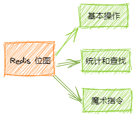

本文主要介绍`Redis`的位图，什么是位图呢？位图的最小单位是`bit`，每个bit的取值只能是0或者1。它不是一个特殊的数据结构，内容为普通的字符串，也就是`byte`数组。所以位图即可以通过`set/get`设置或者获取位图的整个内容，也可以使用`getbit/setbit`把byte数据当成位数组进行操作。


重要从以下几个方面介绍



什么需求下会使用到`Redis`中的位图呢？

在平时开发中遇到存储`bool`型数据存取的情况下使用位图，可以节省很大的存储空间。

例如：用户一年356天的签到情况，使用普通的`key/value`结构使用空间较大。如果使用位图，签到表示1，没签表示0。365天只用46个字节完成记录（365/8=45.625）。

### 基础操作

首先通过python代码获取h的ASCII码是

```python
bin(ord('h'))
'0b1101000'
```

通过`setbit`指令设置`s`为字符`h`。（零存整取)

```
127.0.0.1:6379> setbit s 1 1
(integer) 0
127.0.0.1:6379> setbit s 2 1
(integer) 0
127.0.0.1:6379> setbit s 4 1
(integer) 0
127.0.0.1:6379> get s
"h"
```

零存零取

```
127.0.0.1:6379> setbit w 1 1
(integer) 0
127.0.0.1:6379> setbit w 2 1
(integer) 0
127.0.0.1:6379> setbit w 4 1
(integer) 0
127.0.0.1:6379> getbit w 1
(integer) 1
127.0.0.1:6379> getbit w 2
(integer) 1
127.0.0.1:6379> getbit w 5
(integer) 0
```

整存零取

```
127.0.0.1:6379> set w h
(integer) 0
127.0.0.1:6379> getbit w 1
(integer) 1
127.0.0.1:6379> getbit w 2
(integer) 1
127.0.0.1:6379> getbit w 5
(integer) 0
```

如果位图中存储的是不可打印的字符，get指令获取的是该字符的十六进制形式。

### 统计和查找

`bitcount`指令统计指定范围内1的个数

`bitpos`指令查找指定范围内出现的第一个1或者0

指定范围使用的`[start,end]`，`start`和`end`是字节索引，只能是8的倍数。

如果要计算一个月内的签到次数，不能直接计算只能通过`getrange`获取包含这个月的所有数据再进行统计。

### 魔术指令

前文中的`setbit`和`getbit`只能操作单个位，如果操作多个就需要使用管道。

`redis3.2`之后加入`bitfield`指令，有三个自指令：`get,set,incrby`，不用管道也可以执行一次进行多个位操作。

```
set w hello
bitfield w get u4 0
bitfield w get u3 2
bitfield w get i4 0
bitfield w get i3 2
bitfield w get u4 0 get u3 2 get i4 0 get i3 2

bitfield w set u8 8 97
get w
```

`incrby`，命令可能会溢出，`redis`默认是折返。

```
set w hello
bitfield w incrby u4 2 1
```

`bitfield`提供了溢出策略子指令`overflow`，可以选择溢出行为。

折返 `wrap`

失败 `fail` 报错不执行

饱和截断 `sat` 保持最大值或者最小值

注意：`overflow`指令只影响接下来执行的一条指令，这条命令执行之后策略会变成默认的折返。