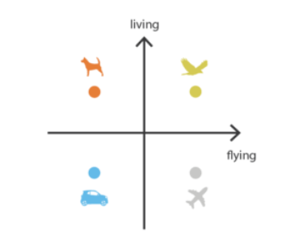
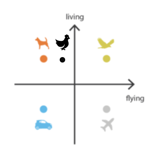
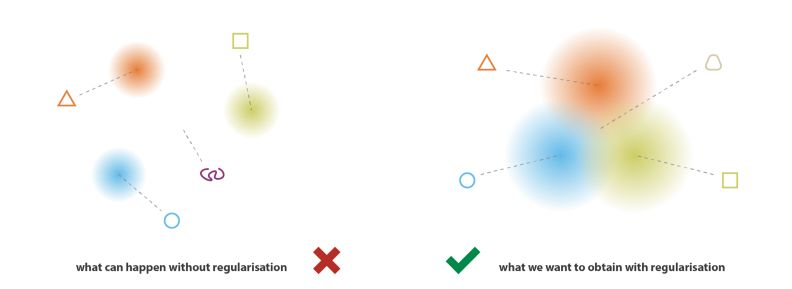
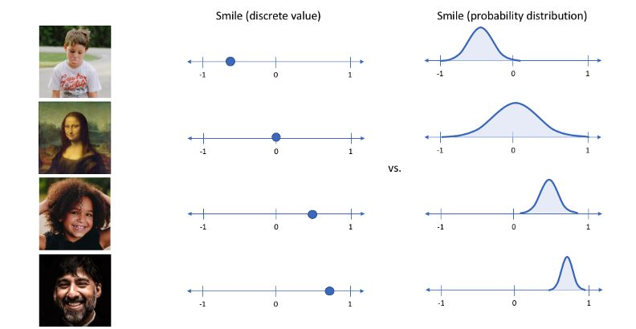
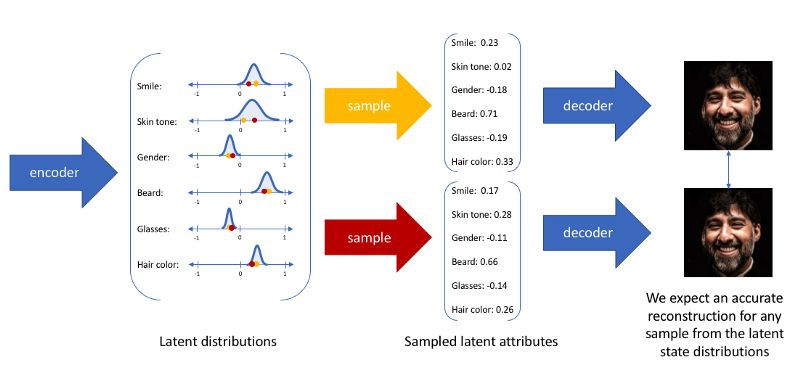
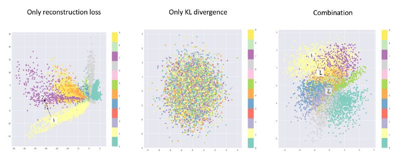

### AE自编码器

首先了解自编码器AE。Auto Encoder是一种自监督的神经网络，它学习如何将输入编码为更低的维数，然后再次解码和重构数据以尽可能有效地接近输入。

> Autoencoder由3个部分组成:
>
> - 编码器，将输入数据编码为较低维表示的层。
> - 压缩层，包含编码/压缩表示的最低维数的层。也被称为瓶颈。
> - 译码器，学会解码或重新构造编码表示到数据的层接近输入数据。

为了学习最好的编码和解码，自编码器的目标是使重构误差最小化，重构误差基本上是重构数据和输入数据之间的差值。**L2(平方)重构损失**
$$
Recontructed Loss = ||Input-Reconstructed Output||^2
$$

> 自动编码器功能:
>
> - **去噪**:为了使自动编码器学会去噪图像，我们使用一个损坏或有噪声的图像作为输入，然后修改重建损失，使重建输出与原始干净的图像之间的差异最小，而不是损坏的输入。编码器的目标是只编码有用的特征，因此，随机噪声应在重建过程中丢失。
> - **降维**:通过使用输出层比输入层有更少维数的“不完全”自动编码器，自动编码器能够在更低维数的情况下非线性地表示数据，这与有限的线性变换的PCA(主成分分析)方法形成对比。

使用Autoencoder生成新数据背后的想法是通过修改编码的数据(潜在向量)，我们应该能够得到不同于输入的数据。为了简化这一点，让我们想象一下这样的场景:您试图将一些图像编码为2d编码，如下所示。



为了生成一个新的图像，我们可以简单地从上面的潜在空间中采样一个点。例如，如果我们对狗和鸟之间的一个点进行采样，我们可能能够得到一张鸟和狗杂交的图像，或者一种新的动物。

然而，编码器生成的向量(编码)往往是不规则的、无组织的或不可解释的，因为它的目的只是重构尽可能相似的输入，而本身没有任何约束。因此，它不关心如何编码数据，只要它能完美地重构输入。

不规则潜在空间的随机点可能会产生无意义的结果

由于自动编码器模型可以自由地编码潜在向量，潜在空间可能会有很多区域，其中的空白区域会产生随机/不可解释的输出，如图中的空白区域所示。相反，我们希望具有有意义输出的潜在空间区域是连续的，而不是像下图那样是分开的，这样可以方便地在不同属性之间进行插值。

要获得具有良好性质的潜在空间，必须正则化返回的分布。因此，可变自动编码器试图通过添加调节器来解决这一问题，避免过拟合，并确保潜在空间具有良好的连续性特征，使生成过程成为可能。

### VAEs变分自编码器

可变自动编码器以概率方式(分布)编码输入的潜在属性，而不是像普通的自动编码器那样以确定性方式(单值)编码。

想象一下上面的例子，自动编码器将图像编码为表示照片中的微笑的潜在属性(注意，在真实的训练中，我们不知道每个属性实际表示什么)。普通的自动编码器将为潜属性提供一个值，但变分自动编码器将潜属性存储为属性的概率分布，如上面的右图所示。

现在，由于我们有了每个属性的概率分布，我们可以简单地从分布中**抽取任何值**来生成一个新的输出。

我知道VAE将潜在变量存储为概率分布时我首先想到的问题是如何存储一个分布。我们假设潜在分布总是高斯分布。高斯分布可以很容易地用两个值来描述，即均值和方差或标准差(您可以从方差计算出标准差)。

##### 数学基础

###### 熵Entropy

假设p(x)是一个分布函数，满足在x上的积分为1，那么p(x)的熵定义为H(p(x))，简写H(p)。
$$
H(p) = \int p(x)log\frac{1}{p(x)}dx
$$
分布函数越分散熵越大，分布函数越集中熵越小。

###### 交叉熵Cross-Entropy

假设两个分布函数p(x)和q(x)，那么交叉熵定义为H(p,q)。
$$
H(p,q) = \int p(x)\frac{1}{q(x)}dx
$$
交叉熵的小大评价了两个分布函数的相似与否。交叉熵小分布相似，交叉熵大分布不相似。

###### KL散度

假设p(x)和q(x)是两个分布函数，KL散度的小大评价了两个分布函数的相似与否，并且考虑了p(x)分布的信息量
$$
KL(p,q) = H(p,q)-H(p)
$$
VAEs的损失函数：
$$
L(x,\widehat{x}) + KL(q,p)
$$

##### 为什么同时使用重构损失和kl散度?

在讨论了kl散度之后，为什么我们仍然在整体损失函数中使用重构损失呢?为了理解损失函数背后的原理，以及重构损失和KL散度对潜在空间的影响。让我们看看下面的图表。

只使用重构损失时潜在空间内部将有空隙，不真正代表任何有意义的数据。因此，可变自动编码器使用分布而不是最小的差异与kl -散度。但是，如果我们只专注于用我们的kl -散度损失项模拟先验分布，我们将会将每个单位描述为单位正态分布，而不能描述原始数据。

因此，通过使用两者的组合，我们将获得一个平衡，即拥有一个接近先验分布但仍然描述输入的某些特征的潜在表示。

